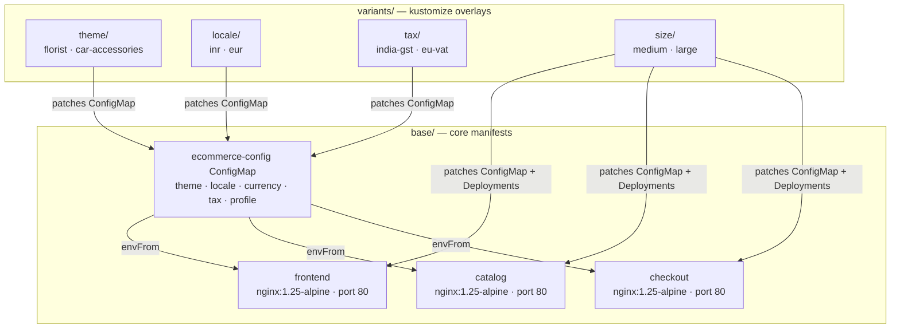

<div align="center">

# 🛒 ecommerce-kpt

**A production-ready kpt package for deploying a configurable e-commerce platform on Kubernetes.**

Supports multiple themes, locales, tax regimes, and deployment sizes —  
all via clean, composable kustomize overlays. No manual file editing required.

[](https://kubernetes.io)
[](https://kpt.dev)
[](https://kustomize.io)
[](LICENSE)

[Quick Start](#-quick-start) · [Variants](#-variants-reference) · [Combining Variants](#-combining-variants) · [Validation](#-validation) · [Contributing](#-contributing)

</div>

---

## 📌 Overview

`ecommerce-kpt` is a Kubernetes configuration package built with [kpt](https://kpt.dev) and [kustomize](https://kustomize.io). It models a simplified e-commerce deployment with three services, fully configurable through a single ConfigMap and a set of independent variant overlays.

> **Design principle:** All configuration lives in one place. Variants override only what they own. Nothing is duplicated.

### What's Inside

| Service    | Image              | Role                          | Port |
|------------|--------------------|-------------------------------|------|
| `frontend` | nginx:1.25-alpine  | Storefront placeholder        | 80   |
| `catalog`  | nginx:1.25-alpine  | Product catalog API           | 80   |
| `checkout` | nginx:1.25-alpine  | Order and checkout API        | 80   |

### What's NOT Included (By Design)

| Excluded                  | Reason                                      |
|---------------------------|---------------------------------------------|
| Real application code     | Package is infrastructure-only              |
| Database / persistence    | Out of scope — add your own StatefulSet     |
| Payment processing        | Not required for deployment configuration   |
| Ingress / TLS             | Cluster-specific — add your own             |
| Autoscaling (HPA)         | Add on top of this package as needed        |

---

## 🏗️ Architecture

```
┌──────────────────────────────────────────────────────────────┐
│                    Namespace: ecommerce                      │
│                                                              │
│   ┌─────────────┐   ┌─────────────┐   ┌─────────────┐      │
│   │  frontend   │   │   catalog   │   │  checkout   │      │
│   │   :80       │──▶│   :80       │◀──│   :80       │      │
│   └─────────────┘   └─────────────┘   └─────────────┘      │
│                                                              │
│   ┌──────────────────────────────────────────────────┐      │
│   │              ecommerce-config ConfigMap           │      │
│   │                                                   │      │
│   │  theme · store_name · language · currency         │      │
│   │  currency_symbol · date_format · tax_mode         │      │
│   │  tax_rate · tax_label · tax_inclusive · profile   │      │
│   └──────────────────────────────────────────────────┘      │
└──────────────────────────────────────────────────────────────┘
```

All three services consume the shared ConfigMap via `envFrom`. Variants patch only specific fields in this ConfigMap — or in Deployment resources for size changes.
---


## 📁 Project Structure

```
ecommerce-kpt/
│
├── base/                                 # Source of truth — all K8s resources
│   ├── Kptfile                           # Package metadata
│   ├── kustomization.yaml                # Resource list
│   ├── namespace.yaml                    # Namespace: ecommerce
│   ├── configmap.yaml                    # All config fields with defaults
│   ├── frontend-deployment.yaml
│   ├── frontend-service.yaml
│   ├── catalog-deployment.yaml
│   ├── catalog-service.yaml
│   ├── checkout-deployment.yaml
│   └── checkout-service.yaml
│
└── variants/                             # Independent overlays per dimension
    │
    ├── theme/
    │   ├── florist/                      # Petal & Bloom — floral store
    │   │   ├── Kptfile
    │   │   ├── kustomization.yaml
    │   │   └── configmap-patch.yaml      # Patches: theme, store_name
    │   └── car-accessories/              # AutoParts Pro — auto store
    │       ├── Kptfile
    │       ├── kustomization.yaml
    │       └── configmap-patch.yaml
    │
    ├── locale/
    │   ├── inr/                          # Hindi · Indian Rupee ₹
    │   │   ├── Kptfile
    │   │   ├── kustomization.yaml
    │   │   └── configmap-patch.yaml      # Patches: language, currency, date_format
    │   └── eur/                          # German · Euro €
    │       ├── Kptfile
    │       ├── kustomization.yaml
    │       └── configmap-patch.yaml
    │
    ├── tax/
    │   ├── india-gst/                    # GST 18%, tax-inclusive
    │   │   ├── Kptfile
    │   │   ├── kustomization.yaml
    │   │   └── configmap-patch.yaml      # Patches: tax_mode, tax_rate, tax_label
    │   └── eu-vat/                       # VAT 20%, tax-inclusive
    │       ├── Kptfile
    │       ├── kustomization.yaml
    │       └── configmap-patch.yaml
    │
    └── size/
        ├── medium/                       # 2 replicas · moderate resources
        │   ├── Kptfile
        │   ├── kustomization.yaml
        │   ├── configmap-patch.yaml      # Patches: profile
        │   ├── frontend-patch.yaml       # Patches: replicas, resources
        │   ├── catalog-patch.yaml
        │   └── checkout-patch.yaml
        └── large/                        # 4 replicas · production resources
            ├── Kptfile
            ├── kustomization.yaml
            ├── configmap-patch.yaml
            ├── frontend-patch.yaml
            ├── catalog-patch.yaml
            └── checkout-patch.yaml
```

---

## ⚡ Quick Start

### Prerequisites

| Tool       | Minimum Version | Check Command              |
|------------|-----------------|----------------------------|
| kubectl    | v1.26           | `kubectl version --client` |
| kpt        | v1.0            | `kpt version`              |
| Kubernetes | v1.26           | minikube, kind, or cloud   |

### 1. Clone the repository

```bash
git clone https://github.com/SurbhiAgarwal1/ecommerce-kpt.git
cd ecommerce-kpt/ecommerce-kpt
```

### 2. Deploy the base package

```bash
kubectl kustomize base/ | kubectl apply -f -
```

### 3. Verify all pods are running

```bash
kubectl get pods -n ecommerce
```

```
NAME                        READY   STATUS    RESTARTS   AGE
catalog-xxx                 1/1     Running   0          30s
checkout-xxx                1/1     Running   0          30s
frontend-xxx                1/1     Running   0          30s
```

### 4. Apply a variant

```bash
kubectl kustomize variants/locale/inr/ | kubectl apply -f -
```

---

## 🎛️ Variants Reference

Each variant is a standalone kustomize overlay. Apply any variant with:

```bash
kubectl kustomize variants/<dimension>/<name>/ | kubectl apply -f -
```

---

### 🎨 Theme

Controls store identity — name and visual theme identifier.

| Variant                         | `theme`         | `store_name`    |
|---------------------------------|-----------------|-----------------|
| **base (default)**              | boutique        | My Boutique     |
| `variants/theme/florist`        | florist         | Petal & Bloom   |
| `variants/theme/car-accessories`| car-accessories | AutoParts Pro   |

**Fields patched:** `theme`, `store_name`

```bash
kubectl kustomize variants/theme/florist/ | kubectl apply -f -
```

---

### 🌍 Locale / Currency

Controls language, currency, and date formatting across all services.

| Variant               | `language` | `currency` | `symbol` | `date_format` |
|-----------------------|------------|------------|----------|---------------|
| **base (default)**    | en         | USD        | $        | MM/DD/YYYY    |
| `variants/locale/inr` | hi         | INR        | ₹        | DD/MM/YYYY    |
| `variants/locale/eur` | de         | EUR        | €        | DD.MM.YYYY    |

**Fields patched:** `language`, `currency`, `currency_symbol`, `date_format`

```bash
kubectl kustomize variants/locale/inr/ | kubectl apply -f -
```

---

### 🧾 Tax

Controls tax calculation mode, rate, display label, and inclusive/exclusive pricing.

| Variant                  | `tax_mode`   | `tax_rate` | `tax_label` | `tax_inclusive` |
|--------------------------|--------------|------------|-------------|-----------------|
| **base (default)**       | us_sales_tax | 0.08 (8%)  | Sales Tax   | false           |
| `variants/tax/india-gst` | india_gst    | 0.18 (18%) | GST         | true            |
| `variants/tax/eu-vat`    | eu_vat       | 0.20 (20%) | VAT         | true            |

**Fields patched:** `tax_mode`, `tax_rate`, `tax_label`, `tax_inclusive`

```bash
kubectl kustomize variants/tax/india-gst/ | kubectl apply -f -
```

---

### 📦 Deployment Size

Controls replica count and compute resources for all three services.

| Variant                | `profile` | Replicas | CPU Request | CPU Limit  | Memory Limit |
|------------------------|-----------|----------|-------------|------------|--------------|
| **base (default)**     | small     | 1        | 50m         | 100–200m   | 128–256Mi    |
| `variants/size/medium` | medium    | 2        | 100m        | 300–400m   | 256–512Mi    |
| `variants/size/large`  | large     | 4        | 200m        | 500–1000m  | 512Mi–1Gi    |

**Fields patched:** `profile` in ConfigMap · `replicas` and `resources` in each Deployment

```bash
kubectl kustomize variants/size/medium/ | kubectl apply -f -
```

---

## 🔀 Combining Variants

Variants are independent and composable. Create a custom overlay to combine multiple dimensions.

**Example: Indian florist store with GST and medium sizing**

```yaml
# overlays/india-florist/kustomization.yaml
apiVersion: kustomize.config.k8s.io/v1beta1
kind: Kustomization
resources:
  - ../../base
patches:
  - path: ../../variants/theme/florist/configmap-patch.yaml
    target:
      kind: ConfigMap
      name: ecommerce-config
  - path: ../../variants/locale/inr/configmap-patch.yaml
    target:
      kind: ConfigMap
      name: ecommerce-config
  - path: ../../variants/tax/india-gst/configmap-patch.yaml
    target:
      kind: ConfigMap
      name: ecommerce-config
  - path: ../../variants/size/medium/configmap-patch.yaml
    target:
      kind: ConfigMap
      name: ecommerce-config
  - path: ../../variants/size/medium/frontend-patch.yaml
    target:
      kind: Deployment
      name: frontend
  - path: ../../variants/size/medium/catalog-patch.yaml
    target:
      kind: Deployment
      name: catalog
  - path: ../../variants/size/medium/checkout-patch.yaml
    target:
      kind: Deployment
      name: checkout
```

```bash
kubectl kustomize overlays/india-florist/ | kubectl apply -f -
```

**Result:** Petal & Bloom · Hindi/₹ · GST 18% · 2 replicas each

---

## ✅ Validation

### Step 1 — Local render check (no cluster required)

Preview a variant before applying it:

```bash
# Verify locale variant
kubectl kustomize variants/locale/inr/ | grep -E 'currency|language'
```
```
  currency: INR
  currency_symbol: ₹
  language: hi
```

```bash
# Verify size variant replica count
kubectl kustomize variants/size/medium/ | grep 'replicas'
```
```
  replicas: 2   # appears 3 times (one per service)
```

```bash
# Verify tax variant
kubectl kustomize variants/tax/india-gst/ | grep -E 'tax_'
```
```
  tax_inclusive: "true"
  tax_label: GST
  tax_mode: india_gst
  tax_rate: "0.18"
```

### Step 2 — Cluster state check (after apply)

```bash
# All pods running
kubectl get pods -n ecommerce

# ConfigMap values on cluster
kubectl get configmap ecommerce-config -n ecommerce -o yaml

# Deployment replica counts
kubectl get deployments -n ecommerce \
  -o custom-columns='NAME:.metadata.name,REPLICAS:.spec.replicas,READY:.status.readyReplicas'
```

Expected after `variants/size/medium/`:
```
NAME       REPLICAS   READY
catalog    2          2
checkout   2          2
frontend   2          2
```

### Dry-run (validate schema without applying)

```bash
kubectl kustomize variants/size/large/ | kubectl apply --dry-run=server -f -
```

---

## 🔒 What Is Not Configurable

The following are intentionally hardcoded to keep the package simple and reviewable.  
Edit `base/` directly if you need to change them.

| Field               | File                              | Hardcoded Value       |
|---------------------|-----------------------------------|-----------------------|
| Container images    | `base/*-deployment.yaml`          | `nginx:1.25-alpine`   |
| Namespace           | `base/namespace.yaml`             | `ecommerce`           |
| Service ports       | `base/*-service.yaml`             | `80` (all services)   |
| Readiness probe path| `base/*-deployment.yaml`          | `/`                   |
| Inter-service URL   | `base/checkout-deployment.yaml`   | `http://catalog:80`   |

---

## 🤝 Contributing

Contributions are welcome! To add a new variant:

1. Fork the repository
2. Create a branch: `git checkout -b feature/my-variant`
3. Add your variant under `variants/<dimension>/<name>/`
4. Include `Kptfile`, `kustomization.yaml`, and patch files
5. Test locally: `kubectl kustomize variants/<dimension>/<name>/`
6. Open a pull request with a clear description of what the variant changes

---

## 📄 License

MIT License — see [LICENSE](LICENSE) for details.

---

<div align="center">

Made by [Surbhi Agarwal](https://github.com/SurbhiAgarwal1)

</div>
